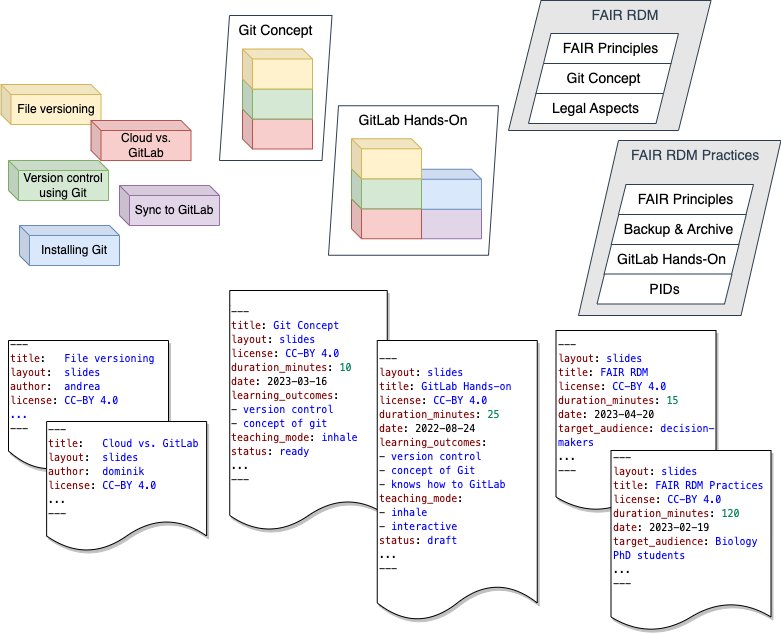

# Teaching materials  - Concept

## A) Modular concept for the DataPLANT OER

## B) Example “version control using Git”

## Origin / Use

The repository provided [here](https://github.com/nfdi4plants/teaching-materials-concept) represents and presents the evolved concept as of March 2023.  

A [teaching materials section](https://github.com/nfdi4plants/nfdi4plants.knowledgebase/tree/main/src/docs/teaching-materials) based on this concept has already been integrated into the [DataPLANT Knowledge Base](https://nfdi4plants.org/nfdi4plants.knowledgebase/index.html) [repsitory](https://github.com/nfdi4plants/nfdi4plants.knowledgebase). 

The concept in [this repository](https://github.com/nfdi4plants/teaching-materials-concept) has been summarized as a contribution to [NFDI CoRDI](https://www.nfdi.de/cordi-2023/?lang=en).

For more details, please see also the [submitted extended abstract to CoRDI2023](./cordi2023_files/extended_abstract/2023-04-25_One-source-to-teach-them-all.pdf), https://doi.org/10.52825/CoRDI.v1i.267 and the [exemplary contribution guide](./CONTRIBUTING.md) which also holds valuable information on the repository overview, suggested file, figure and slide conventions as well as more context on bricks, units, dissemination and yaml headers.

 

Please cite: https://doi.org/10.52825/CoRDI.v1i.267.

 

***Major contributors that developed the teaching-material repository are (in alphabetic order):***

Dominik Brilhaus (@Brilator, https://orcid.org/0000-0001-9021-3197), Martin Kuhl (@Martin-Kuhl, https://orcid.org/0000-0002-8493-1077), Cristina Martins Rodriguez (@CMR248, https://orcid.org/0000-0002-4849-1537), and Andrea Schrader (@andreaschrader, https://orcid.org/0000-0002-3879-7057)

# Acknowledgements
We acknowledge the support of [DataPLANT](https://nfdi4plants.org/), funded by the German Research Foundation (DFG) within the framework of the NFDI – project number: 442077441 and [CEPLAS](https://www.ceplas.eu/), funded by the Deutsche Forschungsgemeinschaft (DFG, German Research Foundation) within Germany´s Excellence Strategy – EXC-2048/1 – project ID 390686111.