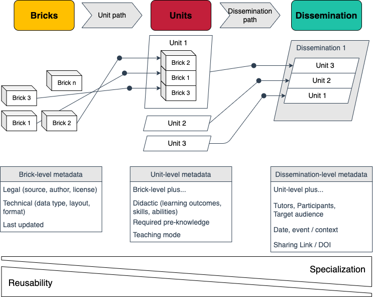

# Teaching materials  - Concept

# Origin / Use

Based on work at the 3rd DataPLANT ARC Hackathon in October 2022, a teaching-material-repository was developed for initial development and optimization.  

The repository provided [here](https://github.com/nfdi4plants/teaching-materials-concept) represents and presents the evolved concept as of March 2022.  

A [teaching materials section](https://github.com/nfdi4plants/nfdi4plants.knowledgebase/tree/main/src/docs/teaching-materials) based on this concept has already been integrated into the [DataPLANT Knowledge Base](https://nfdi4plants.org/nfdi4plants.knowledgebase/index.html) [repsitory](https://github.com/nfdi4plants/nfdi4plants.knowledgebase). 

The concept in [this repository](https://github.com/nfdi4plants/teaching-materials-concept) has been summarized as a contribution to [NFDI CoRDI](https://www.nfdi.de/cordi-2023/?lang=en).

 

***Major contributors that developed the teaching-material repository are (in alphabetic order):***

Dominik Brilhaus (@Brilator, https://orcid.org/0000-0001-9021-3197), Martin Kuhl (@Martin-Kuhl, https://orcid.org/0000-0002-8493-1077), Cristina Martins Rodriguez (@CMR248, https://orcid.org/0000-0002-4849-1537), and Andrea Schrader (@andreaschrader, https://orcid.org/0000-0002-3879-7057)
